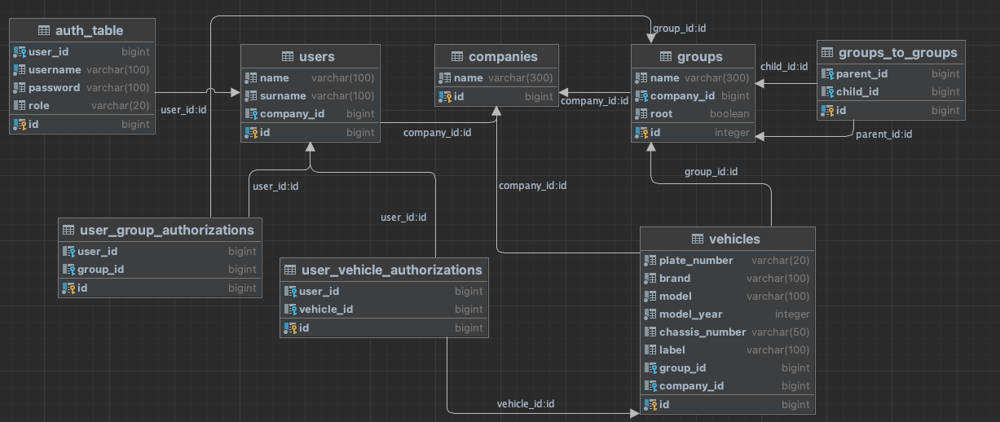

# Mobiliz Mülakat Projesi

Bu proje, Mobiliz firması tarafından tarafıma yönlendirilen bir mülakat sorusuna yönelik geliştirimiştir.

## Mobiliz Hakkında
Mobiliz, Türkiye'nin önde gelen araç takip ve telematik filo yönetimi hizmet sağlayıcısıdır. 15 yılı aşkın deneyimiyle enerji, inşaat, lojistik, taşımacılık gibi farklı sektörlere telematik çözümleri sunmaktadır.

## Proje Konusu
Mobiliz'de müşteriler Mobiliz tarafından sağlanan sistemleri kendi sistemleri gibi kullanırlar. Bu proje kapsamında da birden fazla
firmaya yönelik ortak bir mikroservis geliştirimiştir. CompanyAdmin rolündeki kullanıcılar sisteme araç kayıt etme, kullanıcıyı
araca yetkilendirme, araçları gruplandırma gibi yetkilere sahiptir. Standard roldeki kullanıcılar ise sadece yetkili olduğu gruplar
veya doğrudan yetkili olduğu araçlar üzerinde yetkiye sahiptir. Ayrıca kullanıcıların yetkili olduğu araçları gruplandırılmış şeklinde bir
ağaç yapısında döndüren bir servis geliştirilmesi istenmiştir.

## Kullanılan Teknolojiler

- Spring Boot
- Spring Data JPA
- Hibernate
- Spring Cloud Gateway
- Spring Cloud OpenFeign
- Netflix Eureka Server
- PostgreSQL
- Lombok
- MapStruct
- Swagger

## Veritabanı Şeması

## Mikroservis Mimarisi

Mikroservis mimarisi, projenin hedeflerini gerçekleştirmek için bir arada çalışan çeşitli bileşenleri içerir.

**Kimlik Doğrulama :** Uygulamaya api-gateaway üzerinden yapılan istekler ilgili servise yönlendirilmeden önce auth-service'e
yönlendirilerek kimlik doğrulaması yapılır. Ardından aşağıdaki gibi bir formatta ilgili istek diğer servislere request header
içerisinde yönlendirilir.

{ "userId":1547, "name":"Hüseyin", "surname":"Ateş", "companyId":5879, "companyName":"Mülakat A.Ş.", "role":"Admin"}

**Controller :** Gelen HTTP isteklerini yönetir ve hizmet katmanıyla etkileşim kurar.

**Service :** İş mantığını içerir, veritabanında işlemleri gerçekleştirir ve yetkilendirme kurallarını uygular.

**Repository :** Spring Data JPA kullanarak veri erişimini sağlar.

**DTO'lar (Veri Transfer Nesneleri) :** Katmanlar arası ve harici istemciler arasında veri transferi için kullanılır.

